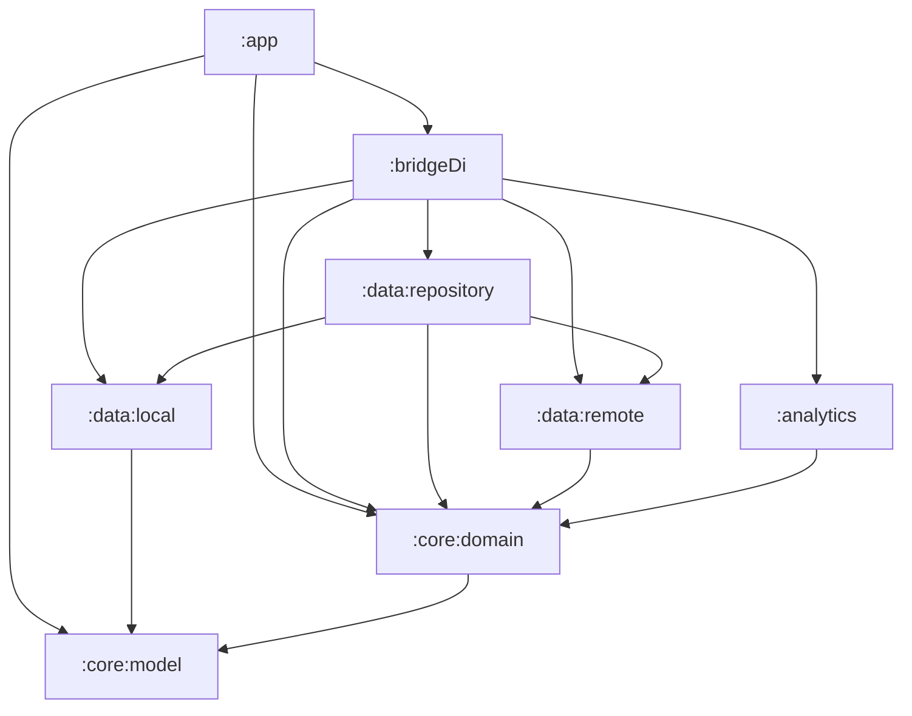

# Ringtone Manager

[](../../actions/workflows/android-ci.yaml)
[](https://kotlinlang.org)
[](https://developer.android.com/jetpack/compose)
[](https://developer.android.com/tools/releases/platforms)

Android app to browse, preview and manage ringtones, backed by Firebase. Built
as a showcase of a modern, modularized Android architecture: Jetpack Compose,
Navigation 3, coroutines/Flow, functional error handling with Arrow, and a
Clean Architecture multi-module setup wired with convention plugins.

## Highlights

- **Multi-module Clean Architecture** with a strict, unidirectional dependency
  graph and pure-JVM domain/model modules.
- **Gradle convention plugins** (`build-logic`) — no copy-pasted build config
  across modules; the same pattern used by Google's *Now in Android*.
- **Offline-first with Room as SSOT** — the UI always reads from the local
  cache; Firestore syncs into Room asynchronously. Cursor-based pagination
  (`orderBy popularity DESC + startAfter`) keeps network cost bounded.
- **Jetpack Compose + Material 3** UI with dynamic color and dark theme.
- **Navigation 3** with a custom multi-stack (per-tab back stack) navigator.
- **Functional error handling**: every fallible operation returns
  `Either<ErrorBO, T>` (Arrow) — errors are values, never exceptions.
- **Audio production quality**: ExoPlayer with proper audio focus + becoming-noisy
  handling; position polling replaced by a `while(isActive) { delay(50ms) }` coroutine.
- **Koin** as the dependency injection container, with a static graph
  verification test (`koin-test verify()`).
- **Core features**: set as device ringtone (MediaStore + `WRITE_SETTINGS`),
  share via share sheet, Firestore-backed favorites per user, in-app language
  selection (`AppCompatDelegate.setApplicationLocales`), password change.
- **Testing**: JUnit 5 + MockK + Turbine for unit tests, Paparazzi for
  screenshot tests, all standardized through a test convention plugin.
- **CI** on GitHub Actions: unit tests, screenshot verification, Detekt, lint,
  Kover coverage gate, module-graph assertions and release build on every PR.

## Tech stack

| Area | Choice |
|------|--------|
| Language | Kotlin 2.3 (K2) |
| UI | Jetpack Compose (BOM 2026.01), Material 3 |
| Navigation | Navigation 3 (`androidx.navigation3`) + custom multi-stack |
| DI | Koin 4.1 |
| Async | Coroutines + Flow |
| Error handling | Arrow `Either<ErrorBO, T>` |
| Media | Media3 / ExoPlayer 1.9 |
| Backend | Firebase (Auth, Firestore, Storage, Analytics, App Check) |
| Auth | Credential Manager (email/password + Google Sign-In) |
| Build | AGP 8.13, Gradle 8.13, convention plugins, JVM 17 |
| Local storage | Room 2.7.1 (KSP) + DataStore Preferences |
| Quality | Detekt (`maxIssues = 0`), Kover coverage gate (≥ 80 % on domain + data) |
| Testing | JUnit 5, MockK, Turbine, Paparazzi, Koin verify |

## Module structure

```
:app                  Presentation — Compose UI, ViewModels, Navigation host
:core:model           Domain models (BO), ErrorBO, shared test fixtures (Mothers)
:core:domain          Use cases + repository interfaces (pure JVM)
:data:repository      Repository implementations (dispatcher orchestration)
:data:remote          Firebase data sources, DTOs, managers, error mapping
:data:local           Room database, DAOs, entities, DataStore preferences
:analytics            Firebase Analytics + Crashlytics implementation
:bridgeDi             DI composition root (Koin modules)
build-logic           Convention plugins (separate included build)
```



Dependencies flow in one direction toward the pure-Kotlin core. `:bridgeDi` is
the only module that knows about every implementation; everything else depends
on abstractions. See [`docs/architecture.md`](docs/architecture.md) for the data
flow and navigation diagrams, and [`docs/adr/`](docs/adr) for the reasoning
behind each major decision.

## Architecture decisions

Key choices are documented as ADRs in [`docs/adr/`](docs/adr):

- [ADR-0001](docs/adr/0001-modularization-by-layer.md) — Modularization by layer
- [ADR-0002](docs/adr/0002-koin-over-hilt.md) — Koin over Hilt
- [ADR-0003](docs/adr/0003-either-for-error-handling.md) — Arrow `Either` for errors
- [ADR-0004](docs/adr/0004-navigation3-multistack.md) — Navigation 3 + multi-stack
- [ADR-0005](docs/adr/0005-firebase-as-backend.md) — Firebase as backend
- [ADR-0006](docs/adr/0006-convention-plugins.md) — Gradle convention plugins

## Testing strategy

| Layer | What is tested | Tools |
|-------|----------------|-------|
| Domain | Use case orchestration & error propagation | JUnit 5, MockK |
| Data | Repositories, Firebase data sources, managers, mappers | JUnit 5, MockK, Turbine |
| Presentation | ViewModel state & events | JUnit 5, MockK, Turbine |
| UI | Screen rendering (screenshots) | Paparazzi |
| DI | Koin graph can be fully satisfied | `koin-test` `verify()` |

Shared test data lives in `:core:model` `testFixtures` as **Mother objects**
(`RingtoneBOMother`, `UserBOMother`, `ErrorBOMother`), consumed across modules.

**Coverage** is measured with [Kover](https://github.com/Kotlin/kotlinx-kover):
`./gradlew koverHtmlReport` produces an aggregated report for the domain and data
layers, and CI enforces a minimum line-coverage gate (`koverVerify`) on those
layers.

## Getting started

### Prerequisites

- JDK 17
- Android SDK with API 36
- A Firebase project (Auth + Firestore + Storage + Analytics + App Check)

### Firebase setup

1. Create a Firebase project and add an Android app with the application id
   `com.germandebustamante.ringtonemanager`.
2. Download `google-services.json` and place it in `app/` (it is **not** tracked
   in version control).
3. Enable Authentication (Email/Password and Google), Firestore (collections
   `ringtones_v1`, `users_v1`), Storage and App Check.
4. Security rules and indexes are versioned in the repo (`firestore.rules`,
   `firestore.indexes.json`, `storage.rules`, `firebase.json`). Deploy them with
   `firebase deploy --only firestore:rules,firestore:indexes,storage`.

### Build & run

```bash
./gradlew assembleDebug        # build the debug APK
./gradlew installDebug         # install on a connected device/emulator
./gradlew test                 # all unit tests
./gradlew detekt               # static analysis
./gradlew verifyPaparazziDebug # verify screenshot tests
```

## License

This project is part of a personal portfolio.
