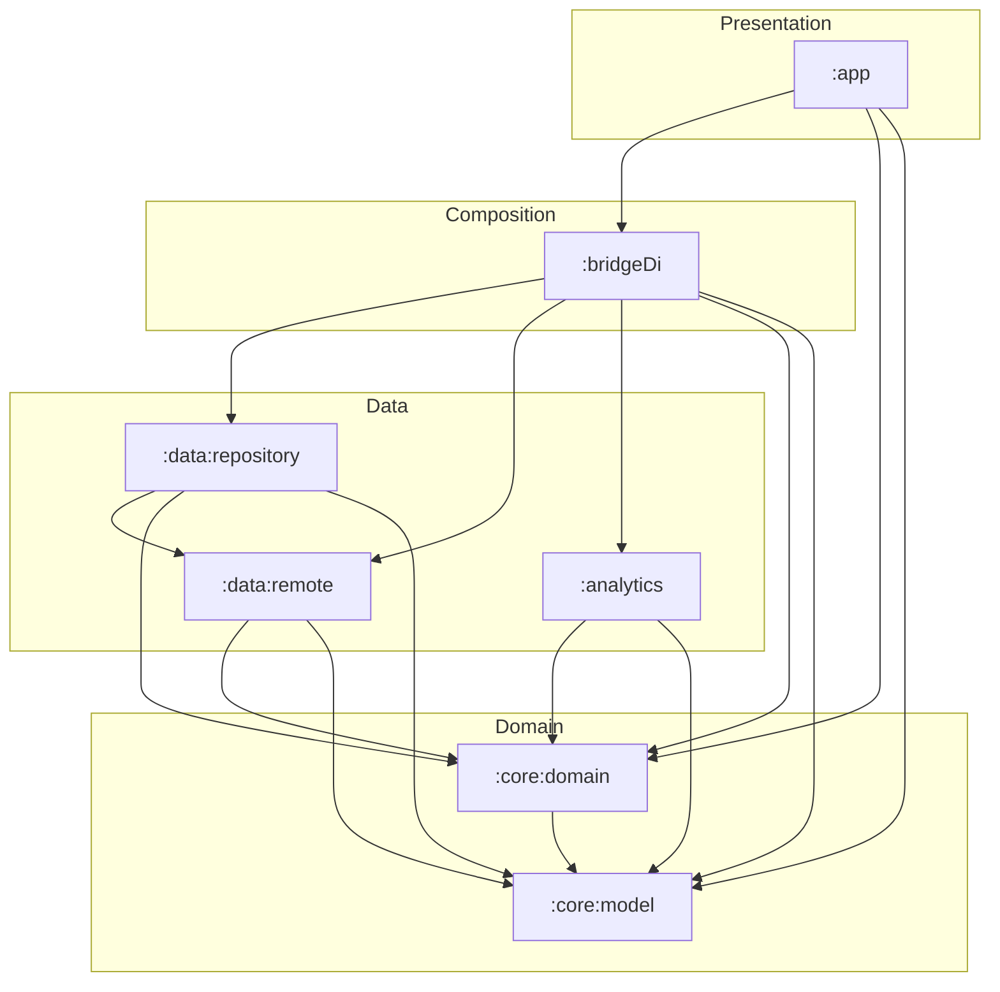
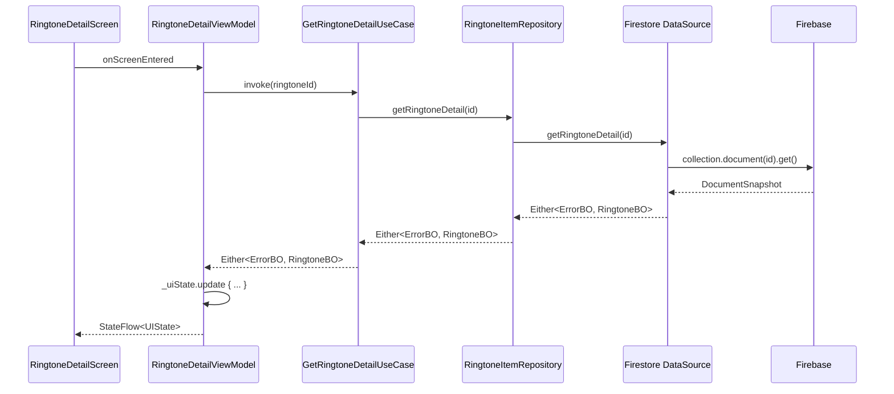
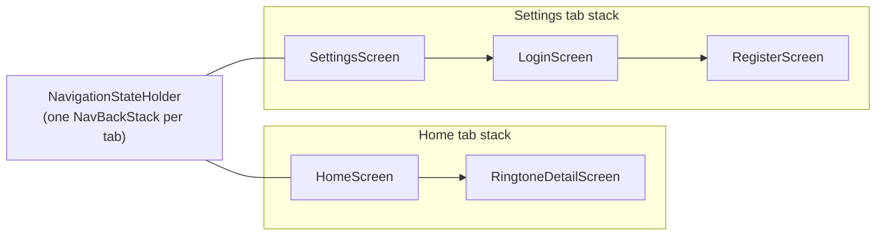

# Architecture

Ringtone Manager follows Clean Architecture with an MVVM presentation layer.
Dependencies point in a single direction toward a framework-free core, so the
domain can be reasoned about and tested without Android or Firebase.

For the *why* behind each choice, see the [ADRs](adr/).

## Module dependency graph



Rules the graph enforces:

- `:core:model` has **no** internal dependencies (pure JVM, Java 11).
- `:core:domain` depends only on `:core:model` and exposes interfaces.
- Presentation (`:app`) never depends on `:data:*` directly — only on domain
  abstractions and the `:bridgeDi` composition root.
- `:bridgeDi` is the single place that sees every concrete implementation and
  binds interfaces to them.

## Layers

| Layer | Modules | Responsibility |
|-------|---------|----------------|
| Presentation | `:app` | Compose UI, ViewModels (extend `BaseViewModel`), navigation host |
| Composition | `:bridgeDi` | Koin modules binding abstractions to implementations |
| Domain | `:core:domain`, `:core:model` | Use cases, repository interfaces, business models (`*BO`), `ErrorBO` |
| Data | `:data:repository`, `:data:remote`, `:analytics` | Repository impls, Firebase data sources, DTOs, analytics |

## Data flow (Unidirectional Data Flow)

State flows down, events flow up. A read of the ringtone detail looks like this:



- ViewModels expose immutable `UIState` via `StateFlow`, collected with
  `collectAsStateWithLifecycle()`.
- One-time effects (navigation, notifications) are emitted through a
  `Channel(...).receiveAsFlow()` and consumed with the `ObserveAsEvent`
  composable.
- Every fallible call returns `Either<ErrorBO, T>`; the ViewModel folds it into
  either a content state or an error state — no exceptions cross layers.

## Navigation (Navigation 3 + multi-stack)

Each bottom tab owns an independent back stack. Back navigation on a non-start
tab routes "through home" before exiting the app.



- `Navigator` emits `NavigationAction`s through a coroutine `Channel` exposed as
  a `Flow`; `MainActivity` collects them and delegates to the
  `NavigationStateHolder`.
- ViewModels depend only on the `Navigator` abstraction, never on Compose
  navigation types — keeping them unit-testable.

## Error model

```
ErrorBO  (sealed interface, :core:model)
├── Server(code, message)
├── NotFound
├── EmailAddressAlreadyInUse
├── InvalidCredentials
├── ParcelizeException
└── Unknown(message)
```

Firebase exceptions are mapped to `ErrorBO` once, at the data-layer edge, via
`Throwable.toErrorBO()`. Everything above the edge speaks only `ErrorBO`.
